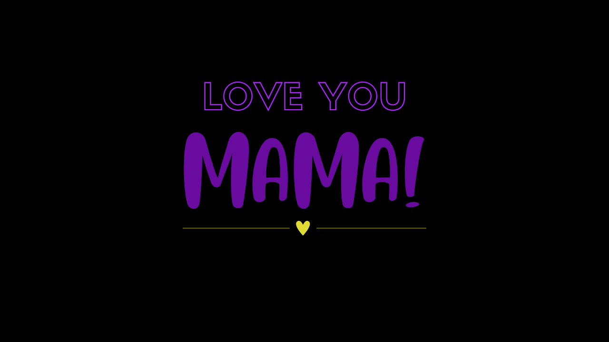

# NFT Project

This was made posible by following the Cyfrin foundry course

This Project contains two types of NFTs
    1. IPFS Hosted NFT
    2. SVG NFT (Hosted 100% on chain) 

## Introduction 

- The IPFS Hosted NFT is called "LoveYouMama" ^_^
- The SVG NFT is a DynamicNFT which represents 2 emotions: Happy and Sad. It changes according to the Mood of the owner


<p align="center">
 
 
 
</p>

## Prerequisities

To work on this project, you need the following tools installed:
- [Foundry](https://getfoundry.sh/) (for testing and deploying smart contracts)
- - An Ethereum wallet like [Metamask](https://metamask.io/)

## Clone the Repository 

   ```bash
   git clone https://github.com/DontMind-me/NFT-ERC721-24
   cd NFT-ERC721-24
   ```

## Installs

To interact with the contract, you will have to download the following packages.

```bash
forge install openzeppelin/openzeppelin-contracts@v5.0.2 --no-commit
```

```bash
forge install cyfrin/foundry-devops@0.2.2 --no-commit
```
